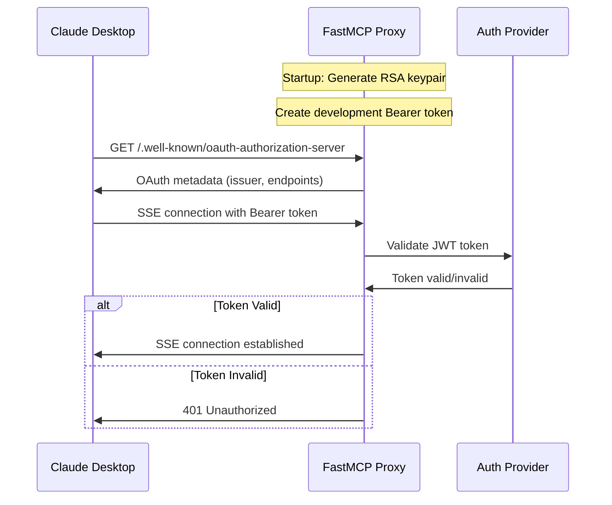
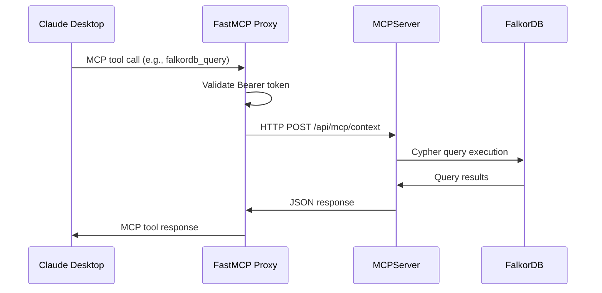

# Architecture Documentation

## System Overview

The FalkorDB FastMCP Proxy provides remote Server-Sent Events (SSE) access to FalkorDB through the Model Context Protocol (MCP), enabling Claude Desktop integration with OAuth 2.1 authentication.

## High-Level Architecture

```mermaid
graph TB
    CD[Claude Desktop] --|SSE/HTTPS|-> FMP[FastMCP Proxy<br/>Port 3001]
    FMP --|HTTP/JSON|-> MCP[FalkorDB MCPServer v1.1.0<br/>Port 3000]
    MCP --|Redis Protocol|-> FDB[FalkorDB<br/>Port 6379]
    
    FMP -.->|OAuth 2.1<br/>Bearer Token| AUTH[Authentication Layer]
    FMP -.->|4 MCP Tools| TOOLS[Tool Registry]
    
    subgraph "Docker Backend"
        MCP
        FDB
    end
    
    subgraph "Local Process"
        FMP
        AUTH
        TOOLS
    end
```

## Component Architecture

### 1. FastMCP Proxy (`src/fastmcp_proxy.py`)

**Role**: MCP-to-HTTP bridge with OAuth 2.1 authentication
**Transport**: Server-Sent Events (SSE)
**Port**: 3001

#### Key Components:
```python
# Core FastMCP server with SSE transport
mcp = FastMCP(name="FalkorDB FastMCP Proxy", auth=auth)

# OAuth 2.1 Bearer Token Authentication  
auth = BearerAuthProvider(
    public_key=key_pair.public_key,
    issuer="https://falkordb-fastmcp-proxy",
    audience="falkordb-mcp-server",
    algorithm="RS256"
)

# HTTP client for backend communication
http_client = httpx.AsyncClient(timeout=30.0)
```

#### MCP Tools Implemented:
1. **`falkordb_query`** - Execute Cypher queries
2. **`falkordb_list_graphs`** - List available graphs  
3. **`falkordb_server_info`** - Get server metadata
4. **`falkordb_health`** - Health check

### 2. FalkorDB MCPServer v1.1.0 (Docker)

**Role**: Graph database API server
**Technology**: Node.js/TypeScript MCP server
**Port**: 3000

#### API Endpoints:
- `POST /api/mcp/context` - Execute Cypher queries
- `GET /api/mcp/graphs` - List graphs
- `GET /api/mcp/metadata` - Server capabilities  
- `GET /health` - Health status

#### Features:
- Multi-tenant support (configurable)
- Graph name prefixing
- Comprehensive error handling
- Performance monitoring

### 3. FalkorDB (Docker)

**Role**: Graph database engine
**Technology**: Redis-based graph database
**Port**: 6379

#### Capabilities:
- ACID transactions
- Cypher query language
- Property graph model
- High-performance graph operations

## Authentication Flow

### OAuth 2.1 Bearer Token Flow



### JWT Token Structure
```json
{
  "alg": "RS256",
  "typ": "JWT"
}
{
  "iss": "https://falkordb-fastmcp-proxy",
  "sub": "dev-user", 
  "iat": 1751933075,
  "exp": 1751936675,
  "aud": "falkordb-mcp-server",
  "scope": "read write"
}
```

## Data Flow

### MCP Tool Execution Flow



### Example: Graph Query Flow
```
1. Claude Desktop → falkordb_query("MATCH (n) RETURN n LIMIT 10")
2. FastMCP Proxy → POST /api/mcp/context 
   {
     "query": "MATCH (n) RETURN n LIMIT 10",
     "graph": "default",
     "params": {}
   }
3. MCPServer → FalkorDB GRAPH.QUERY
4. FalkorDB → Query execution results
5. MCPServer → JSON formatted response
6. FastMCP Proxy → MCP tool response
7. Claude Desktop → Display results to user
```

## Network Architecture

### Current Deployment (Hybrid)
```
┌─────────────────┐    ┌──────────────────────┐    ┌─────────────────────┐
│   Claude        │    │   FastMCP Proxy      │    │   Docker Backend    │
│   Desktop       │────│   (Local Process)    │────│                     │
│   (Remote)      │SSE │   Port 3001          │HTTP│   MCPServer:3000    │
└─────────────────┘    └──────────────────────┘    │   FalkorDB:6379     │
                                                   └─────────────────────┘

Network Interfaces:
- 0.0.0.0:3001 → FastMCP Proxy (SSE endpoint)
- localhost:3000 → MCPServer (HTTP API)  
- localhost:6379 → FalkorDB (Redis protocol)
```

### Production Deployment (Recommended)
```
┌─────────────────┐    ┌──────────────────────┐    ┌─────────────────────┐
│   Claude        │    │   Reverse Proxy      │    │   Docker Stack      │
│   Desktop       │────│   (nginx/Apache)     │────│                     │
│   (Internet)    │HTTPS│   Port 443/80       │    │   FastMCP:3001      │
└─────────────────┘    └──────────────────────┘    │   MCPServer:3000    │
                                                   │   FalkorDB:6379     │
                                                   └─────────────────────┘
```

## Error Handling

### Error Propagation Chain
```
FalkorDB Error → MCPServer → FastMCP Proxy → Claude Desktop
```

### Error Categories:
1. **Authentication Errors**: 401 Unauthorized (invalid/missing Bearer token)
2. **Backend Errors**: 502 Bad Gateway (MCPServer unavailable)
3. **Database Errors**: 500 Internal Server Error (FalkorDB issues)
4. **Query Errors**: 400 Bad Request (invalid Cypher syntax)

### Error Response Format:
```json
{
  "error": "error_code",
  "error_description": "Human readable description",
  "details": {
    "backend_status": 500,
    "backend_error": "Connection refused"
  }
}
```

## Performance Considerations

### Latency Profile:
- **FastMCP Proxy Overhead**: < 5ms
- **Authentication**: < 1ms (JWT validation)
- **HTTP Proxying**: < 10ms
- **MCPServer Processing**: 10-50ms  
- **FalkorDB Query**: 1-100ms (query dependent)

**Total Latency**: ~15-165ms (baseline ~25ms)

### Scalability Factors:
- **SSE Connections**: Limited by FastMCP proxy instance
- **Backend Throughput**: MCPServer handles concurrent requests
- **Database Load**: FalkorDB supports high query rates
- **Memory Usage**: Graph data size dependent

### Optimization Strategies:
1. **Connection Pooling**: HTTP client connection reuse
2. **Query Caching**: MCPServer-level result caching
3. **Graph Indexing**: FalkorDB index optimization
4. **Load Balancing**: Multiple FastMCP proxy instances

## Security Architecture

### Defense in Depth:
1. **Transport Security**: HTTPS/TLS encryption
2. **Authentication**: OAuth 2.1 Bearer tokens
3. **Authorization**: JWT scope validation
4. **Network Isolation**: Docker container networking
5. **Input Validation**: Query parameter sanitization

### Trust Boundaries:
```
Internet ─┬─ TLS Termination
          │
          ├─ Bearer Token Validation  
          │
          ├─ HTTP Proxy Layer
          │
          ├─ MCPServer API
          │
          └─ FalkorDB Engine
```

### Security Controls:
- **Token Expiration**: 1-hour default (configurable)
- **Scope Limitation**: Read/write access control
- **Request Logging**: Authentication attempts tracked
- **Error Masking**: Internal errors not exposed

## Monitoring & Observability

### Health Check Endpoints:
- `GET /health` - FalkorDB health via MCPServer
- `GET /.well-known/oauth-authorization-server` - OAuth metadata
- Docker health checks for backend services

### Logging Strategy:
- **FastMCP Proxy**: Authentication events, tool calls, errors
- **MCPServer**: API requests, query execution, performance
- **FalkorDB**: Query logs, performance metrics
- **Docker**: Container lifecycle events

### Metrics Collection:
- Request counts and response times
- Authentication success/failure rates  
- Backend service availability
- Database query performance

---

## Development Architecture

### Code Organization:
```
src/
├── fastmcp_proxy.py     # Main proxy implementation
├── tools/               # MCP tool definitions (future)
└── auth/               # Authentication modules (future)

tests/
├── test_remote_mcp.py   # Integration tests
├── unit/               # Unit tests (future)
└── fixtures/           # Test data (future)

docs/
├── architecture.md      # This document
├── deployment-guide.md  # Deployment instructions
├── known-issues.md      # Bug reports
└── api-reference.md     # API documentation (future)
```

### Technology Stack:
- **FastMCP**: 2.10.2 (MCP server framework)
- **Python**: 3.11+ (runtime)
- **httpx**: HTTP client library
- **cryptography**: JWT/OAuth implementation
- **Docker**: Backend service orchestration
- **FalkorDB MCPServer**: v1.1.0 (backend API)

This architecture provides a solid foundation for extending functionality, improving performance, and ensuring security in production deployments.

---

> **Note**: This document was created with assistance from Claude Sonnet 3.5, an AI assistant by Anthropic.